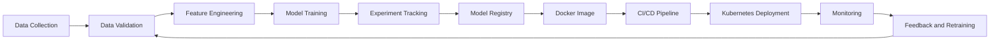

<div align="center">

<p align="center">
  

<a href="https://git.io/typing-svg">
  
</a>

<br/><br/>

<a href="https://github.com/muradalhasan">
  
</a>
<a href="https://www.linkedin.com/in/md-murad-al-hasan-0492b3257/">
  
</a>
<a href="mailto:muradalhassan0407@gmail.com">
  
</a>
<a href="YOUR_PORTFOLIO_URL">
  
</a>

<br/><br/>


</div>

---

## 👨‍💻 About Me

I am a **DevOps and AI enthusiast** focused on building **production-ready AI systems**, automating infrastructure, and creating scalable cloud-native platforms.

My interests sit at the intersection of:

- 🤖 Artificial Intelligence and Machine Learning
- ⚙️ MLOps and model lifecycle automation
- ☁️ Cloud-native infrastructure
- 🐳 Containers and orchestration
- 🔁 CI/CD and release engineering
- 📊 Monitoring, observability, and reliability

I enjoy transforming machine-learning experiments into **secure, reproducible, scalable, and maintainable production services**.

```yaml
name: YOUR_NAME
role: DevOps Engineer and AI Enthusiast
location: YOUR_LOCATION

focus:
  - Production-Ready AI
  - MLOps
  - Kubernetes
  - CI/CD
  - Infrastructure Automation
  - Monitoring and Reliability

currently_learning:
  - Advanced Kubernetes
  - Cloud Architecture
  - LLMOps
  - Distributed Systems
```

---

## 🛠️ Technology Stack

### Programming and Backend

<p align="left">
  
</p>

### DevOps and Infrastructure

<p align="left">
  
</p>

### AI, Machine Learning, and MLOps

<p align="left">
  
</p>

<p align="left">
  
  
  
  
</p>

### Databases and Observability

<p align="left">
  
</p>

### Cloud Platforms

<p align="left">
  
</p>

---

## 🚀 What I Build

<table>
<tr>
<td width="50%" valign="top">

### 🤖 Production AI Systems

- Scalable inference APIs
- Model validation and testing
- Batch and real-time pipelines
- Model packaging and serving
- Monitoring and feedback loops

</td>
<td width="50%" valign="top">

### ⚙️ MLOps Platforms

- Experiment tracking
- Data and model versioning
- Automated training pipelines
- Model registry workflows
- Deployment and rollback strategies

</td>
</tr>

<tr>
<td width="50%" valign="top">

### ☸️ Cloud-Native Infrastructure

- Kubernetes deployments
- Service discovery and ingress
- Autoscaling and health checks
- ConfigMaps and secrets
- Reusable deployment templates

</td>
<td width="50%" valign="top">

### 🔁 DevOps Automation

- CI/CD pipelines
- Infrastructure as code
- Automated testing
- Release workflows
- Logging, metrics, and alerting

</td>
</tr>
</table>

---

## 🏗️ Featured Projects

<table>
<tr>
<td width="50%" valign="top">

### 🤖 Production AI Inference Platform

A production-ready machine-learning inference service with validation, testing, containerization, observability, and automated deployment.

**Tech Stack**

`Python` `FastAPI` `Docker` `Kubernetes` `GitHub Actions`

**Highlights**

- Versioned prediction API
- Health and readiness checks
- Structured logging
- Automated testing
- Kubernetes deployment

[](https://github.com/YOUR_USERNAME/PROJECT_ONE)

</td>
<td width="50%" valign="top">

### 🔁 End-to-End MLOps Pipeline

An automated machine-learning workflow covering data validation, training, experiment tracking, model registration, deployment, and monitoring.

**Tech Stack**

`Python` `MLflow` `DVC` `Docker` `Kubernetes`

**Highlights**

- Reproducible training
- Experiment tracking
- Model versioning
- Deployment automation
- Monitoring and rollback

[](https://github.com/YOUR_USERNAME/PROJECT_TWO)

</td>
</tr>

<tr>
<td width="50%" valign="top">

### ☸️ Kubernetes Deployment Platform

Reusable Kubernetes resources for deploying APIs and AI workloads with autoscaling, ingress, monitoring, and environment-based configuration.

**Tech Stack**

`Kubernetes` `NGINX` `Prometheus` `Grafana` `Helm`

**Highlights**

- Deployment and service manifests
- Ingress configuration
- Autoscaling policies
- Liveness and readiness probes
- Metrics dashboards

[](https://github.com/YOUR_USERNAME/PROJECT_THREE)

</td>
<td width="50%" valign="top">

### 🛠️ Infrastructure Automation Toolkit

A collection of infrastructure-as-code modules, configuration automation, and CI/CD templates for repeatable environments.

**Tech Stack**

`Terraform` `Ansible` `Linux` `Bash` `GitHub Actions`

**Highlights**

- Reusable Terraform modules
- Ansible playbooks
- Automated provisioning
- Environment separation
- CI/CD templates

[](https://github.com/YOUR_USERNAME/PROJECT_FOUR)

</td>
</tr>
</table>

---

## 🔄 Production AI Workflow



---

## 📊 GitHub Analytics

<div align="center">


<br/><br/>


<br/><br/>


</div>

---

## 🎯 Current Focus

```text
01. Building scalable and reliable AI inference systems
02. Automating ML training and deployment workflows
03. Improving Kubernetes and cloud-native architecture skills
04. Designing observable and fault-tolerant services
05. Applying DevOps principles across the ML lifecycle
```

---

## 🧭 Learning Roadmap

```text
Python and Linux
        ↓
Docker and Containerization
        ↓
CI/CD and Automation
        ↓
Kubernetes
        ↓
Cloud Infrastructure
        ↓
MLOps Pipelines
        ↓
Production AI Systems
        ↓
Security, Monitoring, and Reliability
```

---

## 🤝 Connect With Me

<div align="center">

<a href="https://github.com/YOUR_USERNAME">
  
</a>
<a href="https://linkedin.com/in/YOUR_LINKEDIN">
  
</a>
<a href="mailto:YOUR_EMAIL">
  
</a>

<br/><br/>

### “Build it. Automate it. Observe it. Improve it.”


</div>
